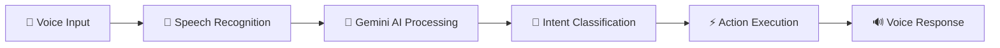

# 🤖 AI Virtual Assistant

<div align="center">
  
  
  
  
  
  
</div>

<div align="center">
  <h3>🎯 A Personalized Voice-Enabled AI Assistant with Custom Avatar Support</h3>
  <p>Built with modern web technologies and powered by Google Gemini AI</p>
</div>

---

## 👥 Team

**Created by**: Gaurav, Sahil Kamboj, Dheeraj Kumar, Shehry, Tamanna 🚀

---

## 🌟 Features

### 🎤 **Voice Interaction**
- **Speech Recognition**: Real-time voice input processing
- **Text-to-Speech**: Natural voice responses
- **Voice Commands**: Execute tasks through voice commands

### 🎨 **Personalization**
- **Custom Avatar**: Choose from multiple AI assistant avatars
- **Personal Assistant Name**: Set your own assistant name
- **User Profiles**: Personalized user experience with authentication

### 🔍 **Smart Commands**
- **🌐 Web Search**: "Search Google for..."
- **📺 YouTube Integration**: "Play on YouTube..." / "Search YouTube for..."
- **🧮 Calculator**: "Open calculator"
- **📱 Social Media**: Quick access to Instagram, Facebook
- **🌤️ Weather**: "What's the weather like?"
- **⏰ Time & Date**: Get current time, date, day information
- **💬 General Q&A**: Powered by Google Gemini AI

### 🔐 **Authentication & Security**
- **JWT Authentication**: Secure user sessions
- **Password Encryption**: bcrypt for password security
- **Cookie-based Sessions**: Persistent login state

---

## 🛠️ Technology Stack

### **Frontend** 🎨
| Technology | Purpose | Version |
|------------|---------|---------|
|  | UI Framework | 19.1.1 |
|  | Build Tool | 7.1.7 |
|  | Styling | 4.1.14 |
|  | Navigation | 7.9.3 |
|  | Icons | 5.5.0 |
|  | HTTP Client | 1.12.2 |

### **Backend** ⚙️
| Technology | Purpose | Version |
|------------|---------|---------|
|  | Runtime | Latest |
|  | Web Framework | 5.1.0 |
|  | Database | 8.18.3 |
|  | Authentication | 9.0.2 |
|  | Image Storage | 2.7.0 |
|  | Password Hashing | 3.0.2 |

### **AI Integration** 🧠
| Technology | Purpose |
|------------|---------|
|  | AI Language Model |
|  | Speech Recognition & Synthesis |

---

## 🚀 How It Works

### 1. **🎯 Voice Command Processing**


### 2. **🤖 AI Response Types**
The assistant can handle various command types:

- **`general`** - Factual questions and conversations
- **`google_search`** - Web search queries
- **`youtube_search`** - YouTube content search
- **`youtube_play`** - Direct YouTube playback
- **`calculator_open`** - Calculator application
- **`instagram_open`** - Social media access
- **`facebook_open`** - Social media access
- **`weather_show`** - Weather information
- **`get_time`** - Current time
- **`get_date`** - Current date
- **`get_day`** - Current day

### 3. **🎨 Personalization Flow**
```
User Registration → Avatar Selection → Assistant Naming → Voice Interaction
```

---

## 📁 Project Structure

```
VirtualAssistant/
├── 🎨 frontend/
│   ├── src/
│   │   ├── 📄 pages/          # React pages (Home, Login, SignUp, Customize)
│   │   ├── 🧩 components/     # Reusable components
│   │   ├── 🎯 context/        # React Context (UserContext)
│   │   ├── 🖼️ assets/         # Images, GIFs, icons
│   │   └── 📱 App.jsx         # Main app component
│   ├── 📦 package.json
│   └── ⚙️ vite.config.js
├── ⚙️ backend/
│   ├── 🔧 config/            # Database & API configurations
│   ├── 🛡️ middlewares/       # Authentication & file upload
│   ├── 📊 models/            # MongoDB schemas
│   ├── 🛣️ routes/            # API endpoints
│   ├── 🎮 controllers/       # Business logic
│   ├── 🤖 gemini.js          # AI integration
│   ├── 🚀 index.js           # Server entry point
│   └── 📦 package.json
└── 📖 README.md
```

---

## 🔧 Installation & Setup

### **Prerequisites** 📋
-  Node.js (v16+)
-  MongoDB
-  Google Gemini API Key
-  Cloudinary Account

### **1. Clone Repository** 📥
```bash
git clone https://github.com/yourusername/virtual-assistant.git
cd virtual-assistant
```

### **2. Backend Setup** ⚙️
```bash
cd backend
npm install

# Create .env file
touch .env
```

**Environment Variables** 🔐
```env
PORT=3000
MONGODB_URI=mongodb://localhost:27017/virtualassistant
JWT_SECRET=your_jwt_secret_key
GEMINI_API_KEY=your_gemini_api_key
GEMINI_API_URL=https://generativelanguage.googleapis.com/v1beta/models/gemini-pro:generateContent
CLOUDINARY_CLOUD_NAME=your_cloudinary_name
CLOUDINARY_API_KEY=your_cloudinary_api_key
CLOUDINARY_API_SECRET=your_cloudinary_secret
```

```bash
# Start backend server
npm run dev
```

### **3. Frontend Setup** 🎨
```bash
cd ../frontend
npm install

# Start development server
npm run dev
```

### **4. Access Application** 🌐
- **Frontend**: http://localhost:5173
- **Backend**: http://localhost:3000

---

## 🎮 Usage Guide

### **Getting Started** 🚀
1. **📝 Sign Up**: Create your account
2. **🎨 Customize**: Choose your AI assistant avatar and name
3. **🎤 Enable Voice**: Allow microphone permissions
4. **💬 Start Chatting**: Click the microphone and start speaking!

### **Voice Commands Examples** 🗣️
```
🔍 "Search Google for latest technology news"
📺 "Play relaxing music on YouTube"
🧮 "Open calculator"
🌤️ "What's the weather like today?"
⏰ "What time is it?"
📅 "What's today's date?"
💬 "Tell me a joke"
📱 "Open Instagram"
```

### **Text Input** ⌨️
You can also type your queries if voice input is not available.

---

## 🔒 Security Features

- **🔐 JWT Authentication**: Secure token-based authentication
- **🛡️ Password Encryption**: bcrypt hashing for passwords
- **🍪 HTTP-only Cookies**: Secure session management
- **🔒 CORS Protection**: Cross-origin request security
- **✅ Input Validation**: Server-side input sanitization

---

## 🤝 Contributing

We welcome contributions! Here's how you can help:

1. **🍴 Fork** the repository
2. **🌿 Create** a feature branch (`git checkout -b feature/AmazingFeature`)
3. **💾 Commit** your changes (`git commit -m 'Add some AmazingFeature'`)
4. **📤 Push** to the branch (`git push origin feature/AmazingFeature`)
5. **🔄 Open** a Pull Request

---

## 📝 License

This project is licensed under the **ISC License** - see the [LICENSE](LICENSE) file for details.

---


## 🙏 Acknowledgments

- **Google Gemini AI** for powerful language processing
- **React Community** for amazing frontend tools
- **Node.js Community** for robust backend solutions
- **MongoDB** for flexible data storage
- **Cloudinary** for image management

---

<div align="center">
  <h3>⭐ If you found this project helpful, please give it a star! ⭐</h3>
  <p>Made with ❤️ by Gaurav</p>
</div>

---

## 📞 Support

If you have any questions or need help, feel free to:
- 🐛 Open an issue
- 💬 Start a discussion
- 📧 Contact the team

**Happy Coding!** 🎉
